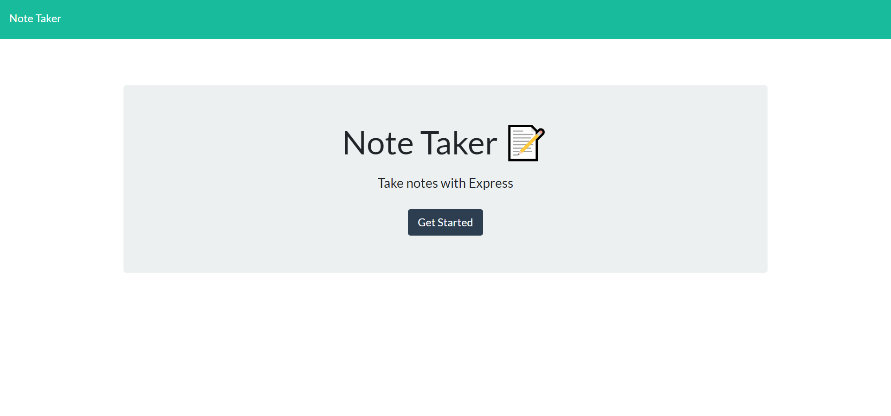

# note_taker

  

  ## Description 

  I built this app to take notes and for the notes to be saved on an api that is being dynamically created as the user inputs their desired note into the form. The app uses a combination of front and back end development working together to save, append and delete notes.  

  AS A user I want an app that will allow me to organize my day <br>
  GIVEN a start screen <br>
  WHEN I click get started <br>
  THEN I am presented with a form to input a title and a note <br>
  WHEN I save a note <br>
  THEN the note is saved to the left of the screen until deleted <br>
  WHEN the delete button is pressed <br>
  THEN the note is deleted from the screen <br>

  

  Once all of the fields are filled out, the user can save their note to be viewed later and or deleted forever from both the db.json file and left window containing the saved notes.

  ## Table of Contents 
  
  * [instalation](#instalation)
  * [Usage](#usage)
  * [License](#license)
  * [Contributing](#contributing)
  * [Questions](#questions)
  
  ## Installation 
  
  To install necessary dependancies, run the following command: 
  ```
  npm i
  ```
  ## Usage
  
  Please use this program to keep yourself organized or remind yourself of events. 
  
  ## License
  
  This project is licensed under the MIT license 
  
  ## Contributing
  
  Please pull from the master branch and make pull requests before you attempt to contribute to this repo.

 ## Questions
  
 If you have any questions anout the repo, open an issue or contact me directly at [solemansay](https://github.com/solemansay/). 
 Or send me an email at solemansay@gmail.com

 ```
Thank you for viewing my Note-Taking project! I hoped you enjoyed my solution and continue to follow my career as a jr full-stack web developer. 
-Soleman Sayeed
```
